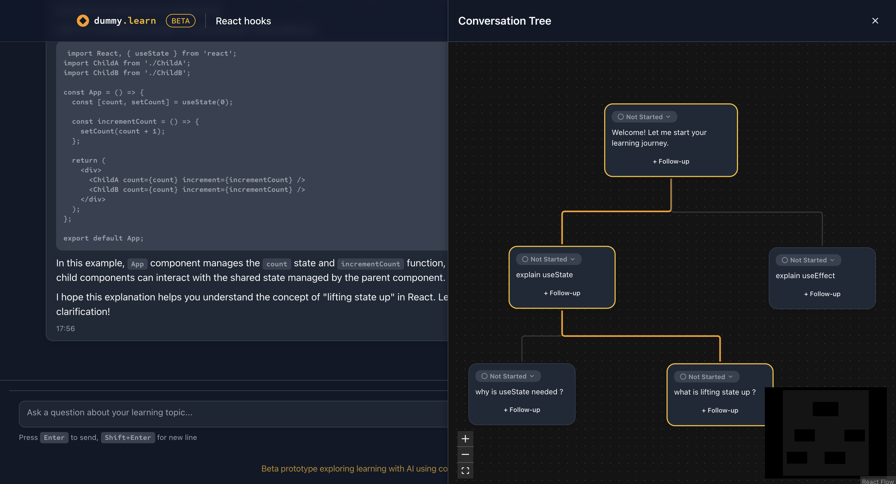
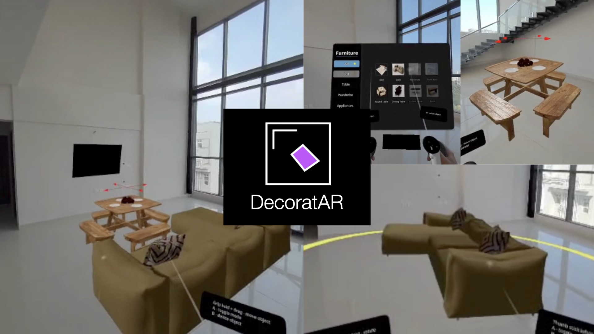
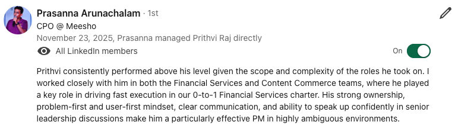
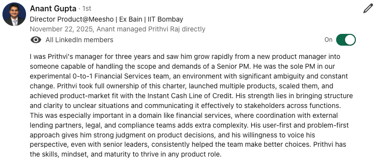
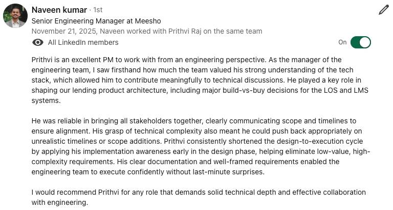
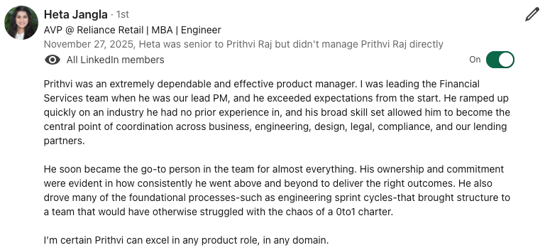

# Prithvi Raj Nair | Product Manager and Engineer

**Building with AI | Bridging Product Thinking with a Passion for Emerging Tech | Ex PM@Meesho, Consultant@BCG, SWE@Microsoft**

I am a Product Manager with a track record of taking 0-to-1 products to PMF and scaling them in high-velocity, ambiguous environments. I launched and scaled Meesho's experimental fintech charter to ₹1Bn in disbursals. I am a hands-on builder with software development experience and a strong curiosity for emerging technologies and human-computer interaction. Currently exploring AI and agentic workflows through complex projects focused on next-generation user experiences using AI.

---

## 🛠️ Skills

<table>
<tr>
<td width="33%" valign="top">

### 📦 Product Management
**User-first and problem-first to the core**

Strong judgment in messy zero to one work. Comfortable owning problem spaces with high ambiguity, complex dependencies, and technical depth. Proven ability to take products from experiment to PMF to scale.

</td>
<td width="33%" valign="top">

### 💻 Technical
**Super powered with AI coding agents**

Solid CS fundamentals and systems thinking ability. I build fast using AI coding agent workflows while understanding of the depth allows me to move across frontend, backend, and architecture decisions.

</td>
<td width="33%" valign="top">

### 🤖 AI Workflows
**Experiment and develop effective workflows**

Deep understanding of how LLMs and agentic systems fit into real workflows. I stay up to date with the cutting edge to experiment with and adopt new workflows for engineering and product.

</td>
</tr>
</table>

---

## 🚀 Projects

<table>
<tr>
<td width="60%" valign="top">

### dummy.learn
**Non-linear AI learning workspace to solve the problem of linear chat interface**

A reimagined approach to AI-assisted learning that breaks free from traditional linear chat interactions.

🔗 [Repository](https://github.com/prithvi-raj-nair/dummy-learn-prototype) | [Live Website](https://dummy-learn-prototype.vercel.app/)

</td>
<td width="40%" align="center">

▶️ *Click to watch demo*

</td>
</tr>
<tr>
<td width="60%" valign="top">

### DecoratAR
**AR furnishing for real-estate demos** *(XRCC Hackathon)*

Augmented reality solution for visualizing furniture and decor in real estate spaces.

🔗 [Repository](https://github.com/Ar9av/xrcc-hackathon) | [Live Website](https://decoratar.netlify.app/)

</td>
<td width="40%" align="center">

▶️ *Click to watch demo*

</td>
</tr>
</table>

---

## 📚 Learning Resources

| Topic | Description | Link |
|-------|-------------|------|
| **AI Agents** | Learn the basics of AI agents and develop a mental model to reason more effectively about building products with LLMs | [View Repo](https://github.com/prithvi-raj-nair/agent-basics) |
| **LLM App MCP Visualiser** | Interactive web app that visualises how an LLM application works, including the Model Context Protocol (MCP) for tool integration | [View Repo](https://github.com/prithvi-raj-nair/agent-basics/blob/main/llm-app-mcp-visualisation/README.md) |
| **Zustand & React Flow** | Learning project for Zustand and React Flow libraries. Learnings doc can be used in other projects for providing context to AI coding agents | [View Repo](https://github.com/prithvi-raj-nair/zustand-react-flow-learning-project) |

---

## 💬 Recommendations

*All recommendations can be viewed on [Prithvi's LinkedIn](https://www.linkedin.com/in/prithvi-raj-nair/)*

<table>
<tr>
<td></td>
<td></td>
</tr>
<tr>
<td></td>
<td></td>
</tr>
</table>

---
